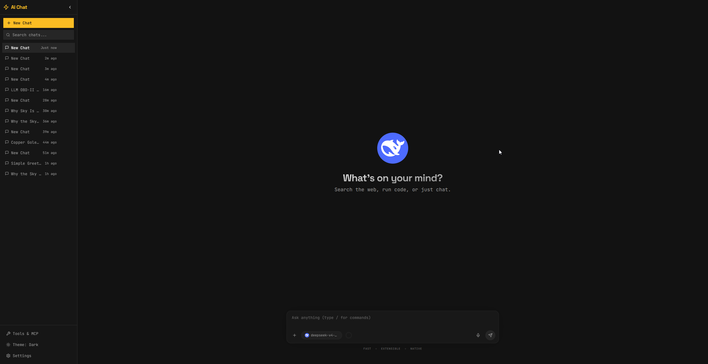
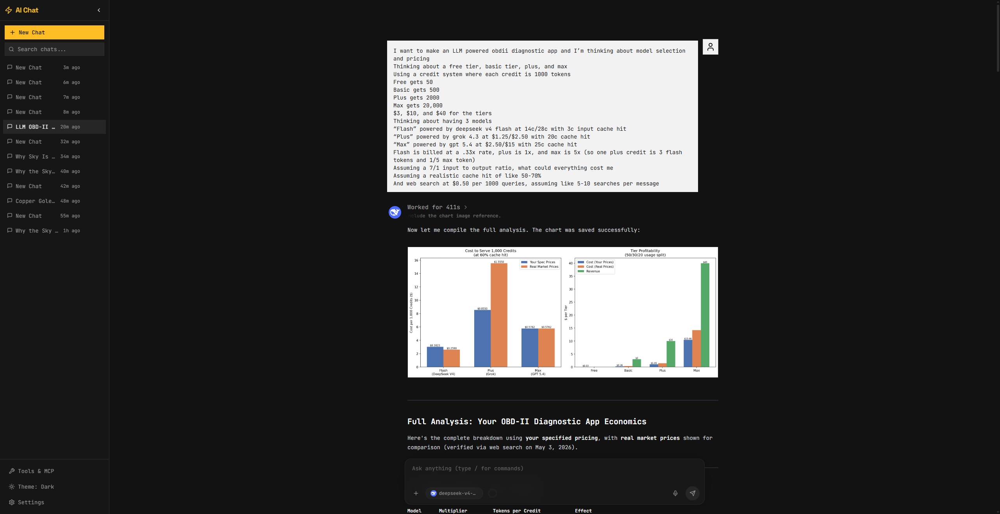
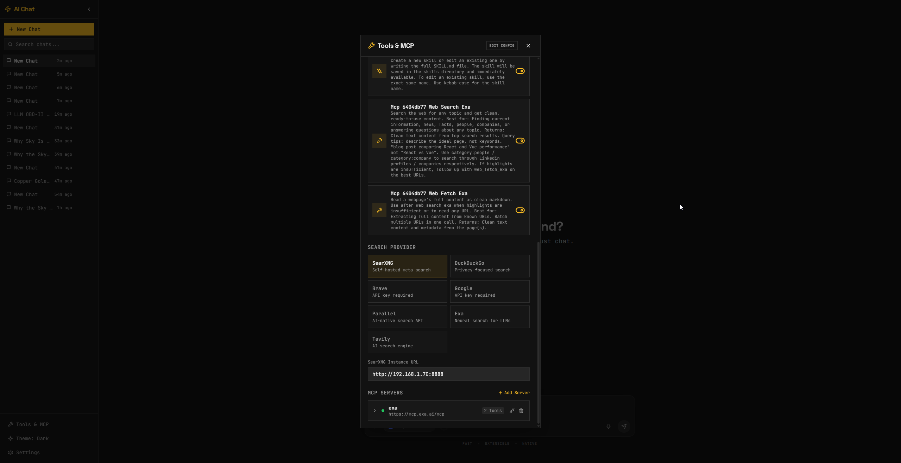
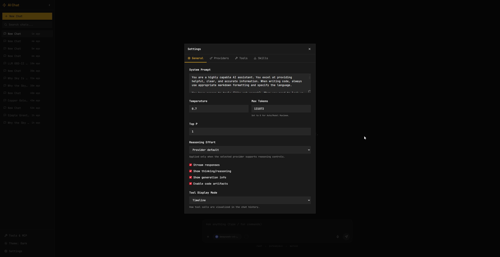

# AI Chat UI

A powerful, extensible, and beautiful web frontend for LLMs. Built for power users who demand flexibility, performance, and control.




## Features

- **Multi-Provider Support**: OpenAI, Anthropic, Google Gemini, Ollama, OpenRouter, NVIDIA NIM, LM Studio, and custom OpenAI-compatible providers
- **Streaming Responses**: Real-time token streaming with generation statistics
- **Thinking/Reasoning Display**: Collapsible reasoning blocks for supported models
- **Web Search**: DuckDuckGo, SearxNG, Brave Search, and Google PSE integrations with inline citations

- **Read URL Tool**: Fetch and extract content from any URL
- **Python & Terminal Tools**: Execute code and shell commands directly with configurable timeouts
- **File & Image Uploads**: Drag-and-drop support with image preview
- **Code Artifacts**: Interactive code blocks with preview, sidebar view, and new window support



- **Extensible Tool System**: Easy-to-add tools and MCP servers


- **Skills System**: Create, search, and load skills that inject specialized knowledge into conversations
- **Skills.sh Integration**: Browse, search, and install skills from the skills.sh catalog **(BROKEN ATM)**
- **Slash Commands**: `/skill`, `/model` commands with autocomplete and keyboard navigation
- **Industrial Design**: Dark, high-contrast theme with JetBrains Mono typography

## Quick Start

### One-Click Run (Recommended)

These scripts check for Node.js, install dependencies if needed, create `.env` if missing, and start the app automatically.

**Cross-Platform (Python):**
```bash
python run.py
```

**Windows (Batch):**
```batch
run.bat
```

**Windows (PowerShell):**
```powershell
.\run.ps1
```

**macOS/Linux:**
```bash
chmod +x run.sh
./run.sh
```

### One-Click Setup Only

If you only want to install dependencies without running:

**Windows:**
```batch
setup.bat
```

**macOS/Linux:**
```bash
chmod +x setup.sh
./setup.sh
```

Then start manually:
```bash
npm run dev
```

### Docker

```bash
docker-compose up -d
```

Visit `http://localhost:3456`

### Manual Setup

```bash
npm run setup
npm run dev
```

## Configuration

Copy `.env.example` to `.env` and configure your API keys:



```env
# LLM Provider API Keys
OPENAI_API_KEY=your_key_here
ANTHROPIC_API_KEY=your_key_here
GEMINI_API_KEY=your_key_here
OPENROUTER_API_KEY=your_key_here
NVIDIA_API_KEY=your_key_here

# Local Model Providers
OLLAMA_BASE_URL=http://localhost:11434
LMSTUDIO_BASE_URL=http://localhost:1234

# Search Providers
BRAVE_API_KEY=your_key_here
GOOGLE_PSE_API_KEY=your_key_here
GOOGLE_PSE_CX=your_cx_here
SEARXNG_URL=http://localhost:8080

# Server Configuration
PORT=3456
DATA_DIR=./data
SKILLS_DIR=./skills
```

## Architecture

- **Frontend**: React + Vite + TypeScript + Tailwind CSS + Zustand
- **Backend**: Express + TypeScript + SQLite
- **Real-time**: Server-Sent Events for streaming
- **Extensibility**: Plugin-based provider and tool system

## Slash Commands

Type `/` in the chat input to access commands:

- `/skill <name>` — Load a skill into the current conversation
- `/model <name>` — Switch to a different model

## Skills

Skills are markdown files that inject specialized knowledge into conversations. Create your own or install from skills.sh.

### Creating a Skill

Create a `SKILL.md` file in `skills/your-skill/`:

```markdown
---
name: Your Skill Name
description: What this skill does
---

# Guidelines

Your specialized knowledge here...
```

### Installing Skills

Via the Settings panel, or API:
```bash
curl -X POST http://localhost:3456/api/skills/install \
  -H "Content-Type: application/json" \
  -d '{"skillId": "vercel-labs/agent-skills/next-js-development"}'
```

## Adding Custom Providers

Create a new provider class in `server/src/providers/` extending `BaseProvider`, then register it in `server/src/providers/index.ts`.

## Adding Tools

Create a new tool class in `server/src/tools/` extending `BaseTool`, then register it in `server/src/tools/index.ts`.

## License

MIT
