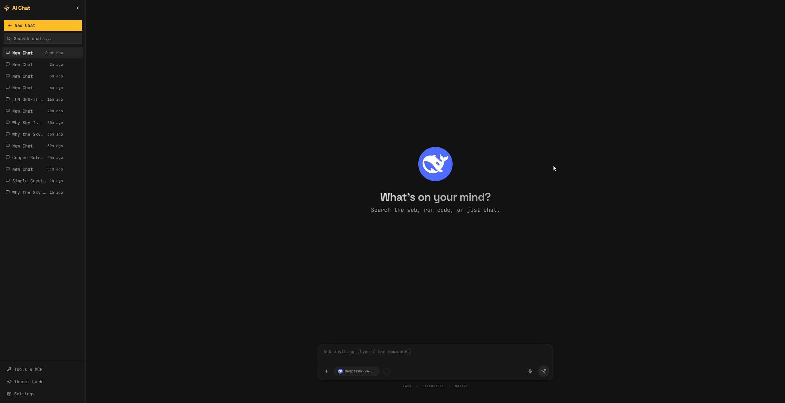
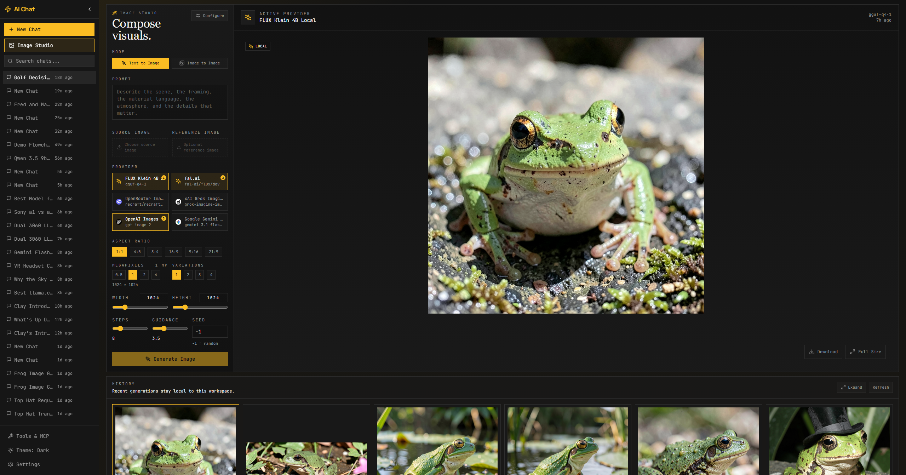
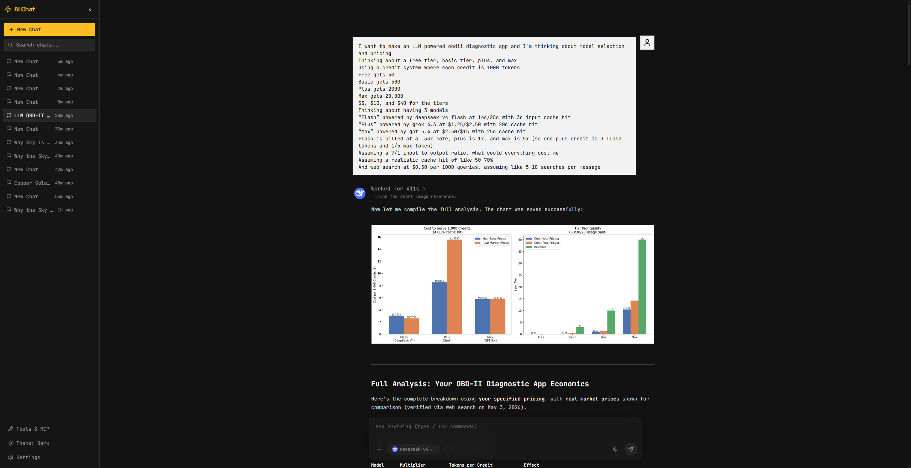
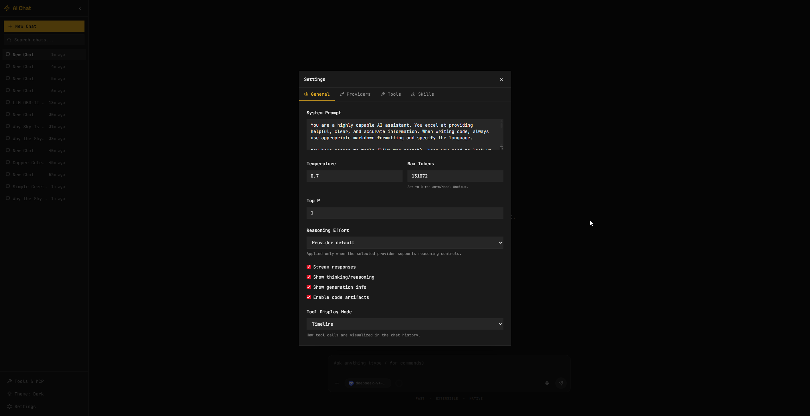

# AI Chat UI

A powerful, extensible, and beautiful web frontend for LLMs. Built for power users who demand flexibility, performance, and control.




## Features

- **Multi-Provider Support**: OpenAI, Anthropic, Google Gemini, Ollama, OpenRouter, NVIDIA NIM, LM Studio, and custom OpenAI-compatible providers.
- **Image Studio**: A dedicated workspace for text-to-image and image-to-image generation. Compare up to 4 image generation models/providers side-by-side (e.g. FLUX, fal.ai, Grok, Gemini, OpenAI) with aspect ratio, resolution, seed, guidance controls, and local generation history.



- **Interactive Code Artifacts**: Real-time preview streaming of HTML, SVG, Markdown, and sandboxed Mermaid.js flowcharts. Features a tabbed view (Code/Preview), checkerboard grids for transparent SVGs, and a draggable resizable sidebar.



- **Streaming Responses**: Real-time token streaming with detailed generation statistics (cost, tokens/sec, prompt evaluation).
- **Thinking & Reasoning**: Collapsible reasoning blocks for reasoning models.
- **Flexible Tool Views**: Multiple tool call display modes including **Timeline Mode** (default vertical step-by-step history), Individual Mode (interleaved thoughts and tool calls chronologically), and Combined Mode.
- **Web Search & Read URL**: Brave Search, DuckDuckGo, SearxNG, and Google PSE integrations with inline citations, plus tools to scrape web page contents.
- **Python & Terminal Execution**: Execute code blocks and run shell commands on the host (venv isolation for Python packages only — **not a security sandbox**), with configurable timeouts. Disable via `ENABLE_PYTHON_TOOL=false` / `ENABLE_TERMINAL_TOOL=false` if you don't need them.
- **Conversation Branching**: Spin up a new session starting from any specific historical message.
- **Performance & Optimization**: Lightweight lazy-loading engine that fetches messages on-demand, combined with asynchronous debounced syntax highlighting and an LRU cache.
- **Extensible Tool & Skills System**: Easily configure custom tools, load MCP servers, and install custom conversational Skills.

## Quick Start

### One-Click Run (Recommended)

These scripts check for Node.js, install dependencies if needed, create `.env` if missing, and start the app automatically.

**Cross-Platform (Python):**
```bash
python run.py
```

**Windows (Batch):**
```batch
run.bat
```

**Windows (PowerShell):**
```powershell
.\run.ps1
```

**macOS/Linux:**
```bash
chmod +x run.sh
./run.sh
```

### One-Click Setup Only

If you only want to install dependencies without running:

**Windows:**
```batch
setup.bat
```

**macOS/Linux:**
```bash
chmod +x setup.sh
./setup.sh
```

Then start manually:
```bash
npm run dev
```

### Docker

```bash
docker-compose up -d
```

Visit `http://localhost:3456`

### Manual Setup

```bash
npm run setup
npm run dev
```

## Configuration

Copy `.env.example` to `.env` and configure your API keys:



```env
# LLM Provider API Keys
OPENAI_API_KEY=your_key_here
ANTHROPIC_API_KEY=your_key_here
GEMINI_API_KEY=your_key_here
OPENROUTER_API_KEY=your_key_here
NVIDIA_API_KEY=your_key_here

# Local Model Providers
OLLAMA_BASE_URL=http://localhost:11434
LMSTUDIO_BASE_URL=http://localhost:1234

# Search Providers
BRAVE_API_KEY=your_key_here
GOOGLE_PSE_API_KEY=your_key_here
GOOGLE_PSE_CX=your_cx_here
SEARXNG_URL=http://localhost:8080

# Server Configuration
PORT=3456
HOST=127.0.0.1
DATA_DIR=./data
SKILLS_DIR=./skills

# Optional: require a token for all /api requests (needed if HOST=0.0.0.0)
# API_AUTH_TOKEN=change-me
```

### Security notes

This app is designed for **local use**. Defaults:

- Binds to `127.0.0.1` only (not the whole LAN / Tailscale interface)
- CORS allowlist for localhost origins (not `cors()` open-to-all)
- Provider API keys are **never** returned by `GET /api/providers` (only a `hasApiKey` flag)
- Empty `apiKey` on PATCH keeps the existing key (cannot wipe/replace via redacted responses)
- Path traversal blocked for workspace tools and skill install (including tar-slip filters)
- Hermes proxy only attaches credentials to **loopback** base URLs by default

**LAN access** can be turned on in **Settings → General → Network**:

- Rebinds to `0.0.0.0` when possible (unless `HOST` is set in the environment, e.g. Docker)
- Allows private-network browser origins
- **Require access token** is on by default (recommended); uncheck it only on a trusted network
- Other devices open a listed LAN URL; if a token is required, paste it once on the unlock screen
- `/uploads` and `/workspace` follow the same access rules as `/api`

Python and terminal tools run **on the host** (not a security sandbox). They are **opt-in**:

```env
ENABLE_PYTHON_TOOL=true
ENABLE_TERMINAL_TOOL=true
```

The optional `https-proxy.mjs` (browser-extension HTTPS) defaults to **127.0.0.1** and **overwrites** `X-Forwarded-For` / `X-Real-IP` with the TCP peer (never trusts client-supplied values). Same-machine use via the proxy stays local; do not set `PROXY_HOST=0.0.0.0` without a token on the app.

**Any reverse proxy** (nginx, Caddy, Traefik, etc.) in front of this app must overwrite both headers with the real client address — never pass client-supplied `X-Forwarded-For` / `X-Real-IP` through. The app prefers the **rightmost** `X-Forwarded-For` hop (safer if a proxy only appends); `X-Real-IP` is fallback only.

**Docker Compose** requires `API_AUTH_TOKEN` in `.env` (fails at startup if missing) because `HOST=0.0.0.0` makes docker-bridge peers non-loopback. That token is required from **everyone including localhost** — intentional; do not “fix” by exempting loopback from `API_AUTH_TOKEN`.

You can still force a token for everyone with `API_AUTH_TOKEN` in `.env` (overrides Settings). Prefer dedicated, rotatable API keys.

Browsing/installing skills from [skills.sh](https://skills.sh) sends search queries and install requests to that third-party service.

## Architecture

- **Frontend**: React + Vite + TypeScript + Tailwind CSS + Zustand
- **Backend**: Express + TypeScript + SQLite
- **Real-time**: Server-Sent Events for streaming
- **Extensibility**: Plugin-based provider and tool system

## Slash Commands

Type `/` in the chat input to access commands:

- `/skill <name>` — Load a skill into the current conversation
- `/model <name>` — Switch to a different model

## Skills

Skills are markdown files that inject specialized knowledge into conversations. Create your own or install from skills.sh.

### Creating a Skill

Create a `SKILL.md` file in `skills/your-skill/`:

```markdown
---
name: Your Skill Name
description: What this skill does
---

# Guidelines

Your specialized knowledge here...
```

### Installing Skills

Via the Settings panel, or API:
```bash
curl -X POST http://localhost:3456/api/skills/install \
  -H "Content-Type: application/json" \
  -d '{"skillId": "vercel-labs/agent-skills/next-js-development"}'
```

## Adding Custom Providers

Create a new provider class in `server/src/providers/` extending `BaseProvider`, then register it in `server/src/providers/index.ts`.

## Adding Tools

Create a new tool class in `server/src/tools/` extending `BaseTool`, then register it in `server/src/tools/index.ts`.

## License

MIT
